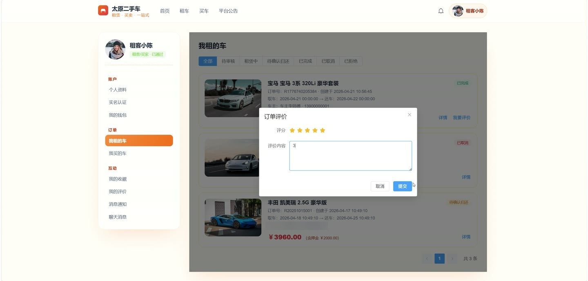
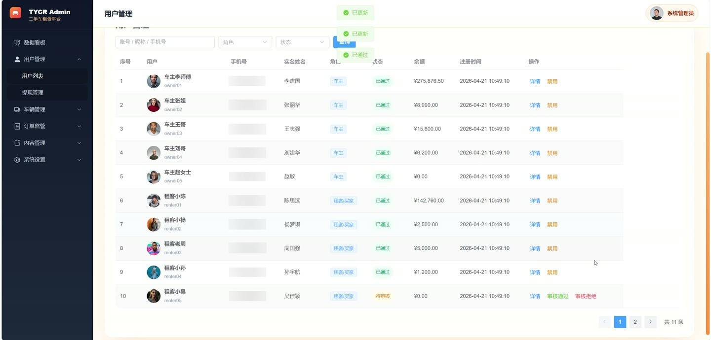
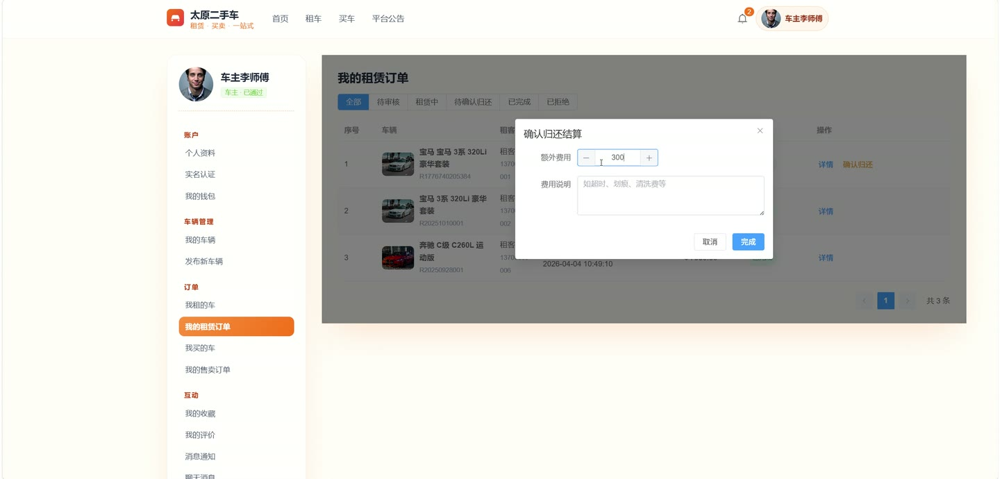

# (附文档)Springboot3+Vue3+MySQL 二手车租赁系统

**技术栈**：Springboot3、Vue3、MySQL

### 系统简介

Springboot3+Vue3+MySQL 二手车租赁系统是一个前后端分离的二手车租赁与交易平台，支持车辆租赁、二手车买卖、在线聊天、钱包充值提现、实名认证等核心业务。系统包含普通用户（租客/买家）、车主（卖家）和管理员三种角色，覆盖从车辆发布、浏览、下单、支付到评价的全流程闭环。
 
### 核心功能
 
### 普通用户端

 
- 浏览车辆列表：支持按业务类型（租赁/出售）、品牌、车型、区域多条件筛选分页查询 
- 查看车辆详情：展示品牌、型号、日租金/售价、车况描述、实拍图片、检测报告等完整信息，浏览时自动增加车辆热度 
- 收藏车辆：点击收藏按钮切换收藏状态，在个人中心查看已收藏车辆列表（含品牌、封面、价格、状态） 
- 创建租赁订单：选择租期（起止时间），系统自动计算租金、押金及平台服务费，提交后等待车主审核 
- 创建购车订单：选择二手车直接下单，提交后在线模拟支付完成交易 
- 管理个人订单：分页查看我的租赁订单和购车订单，支持按状态筛选，可执行取消订单、申请归还车辆操作 
- 发布评价：对已完成的租赁或购车订单提交评价（评分 1-5 星、文字内容），评价会展示在车辆详情页和对方用户主页 
- 在线聊天：与车主/租客发送即时消息，查看会话列表、历史聊天记录，支持未读消息数提醒 
- 钱包管理：查看余额及资金流水明细（按收支类型筛选），在线充值（模拟）、申请提现（填写银行卡信息） 
- 个人中心：编辑昵称、头像、手机号等个人信息，修改登录密码，提交实名认证（上传身份证正反面、驾驶证） 
- 查看公告与轮播图：首页展示平台已发布公告列表和启用的轮播广告图 
- 接收系统通知：分页查看个人通知列表，支持单条标记已读和全部已读操作
 
### 车主端

 
- 发布车辆：填写品牌、型号、车况等级、里程、过户次数、城市区域、日租金/售价等完整信息，上传封面图和详情图片 
- 管理我的车辆：分页查看自己发布的车辆列表，支持按业务类型和状态筛选，可编辑、下架/上架、删除车辆 
- 审核租赁订单：查看租客提交的租赁申请，可审核通过或拒绝（填写拒绝原因） 
- 确认归还结算：租客申请归还后，确认车辆归还并结算，可录入额外费用（如超时费、清洁费）及原因 
- 管理购车订单：查看买家提交的购车订单，确认过户完成，订单自动进入完成状态 
- 查看评价：查看租客/买家对自己车辆的评价列表（含评分和内容） 
- 钱包管理：查看收入流水、申请提现、查看提现记录 
- 在线聊天：与租客/买家进行沟通，查看未读消息
 
### 管理员端

 
- 数据看板：查看平台总览卡片（用户数、车辆数、订单数、交易金额），近 30 天订单趋势图，车辆类型分布饼图，热门品牌 Top5 排行，近 12 月收入统计折线图，用户区域分布图 
- 用户管理：分页查询所有用户（按角色/状态筛选），审核实名认证（通过/拒绝），禁用或启用账号 
- 车辆审核：分页查看待审核车辆列表，审核通过、审核拒绝（填写原因），强制下架违规车辆或重新上架 
- 订单管理：分页查看全部租赁订单和购车订单，按状态筛选，查看订单详情 
- 品牌管理：维护车辆品牌列表（新增、编辑、删除），支持按关键字搜索，品牌排序可调 
- 轮播图管理：管理首页轮播图（新增、编辑、删除），控制启用/禁用状态和排序 
- 公告管理：发布平台公告（标题、内容、封面图），管理已发布/草稿公告，删除公告 
- 平台配置管理：查看和批量更新系统配置项（如平台名称、客服电话、运营城市等） 
- 提现管理：分页查看用户提现申请列表（按状态筛选），审核通过、审核拒绝，确认打款完成 
- 系统日志：分页查看操作日志（按模块/状态筛选），支持单条删除和清空全部日志
 
### 技术栈

 后端框架Spring Boot 3.x ORMMyBatis-Plus 3.5.x 权限认证JWT Token 鉴权 + 自定义拦截器 数据库MySQL 8.x 前端框架Vue 3.x (Composition API) 状态管理Pinia 前端路由Vue Router 4.x 构建工具Vite UI 组件库Element Plus HTTP 客户端Axios
 
### 交付内容

 
- 后端完整源码 
- 前端完整源码 
- 数据库初始化脚本 
- 万字文档

## 界面展示

---

## 获取完整源码 + 万字文档

本仓库为项目介绍页。**完整前后端源码、数据库初始化脚本、万字项目文档**，请加微信 `kangkangcode`，或访问 [codekk.top](http://codekk.top) 获取。

可作课程设计 / 毕业设计参考，支持远程部署调试。